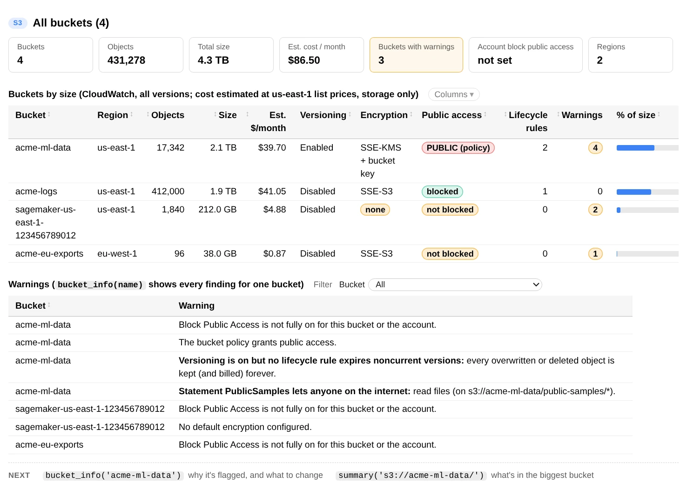
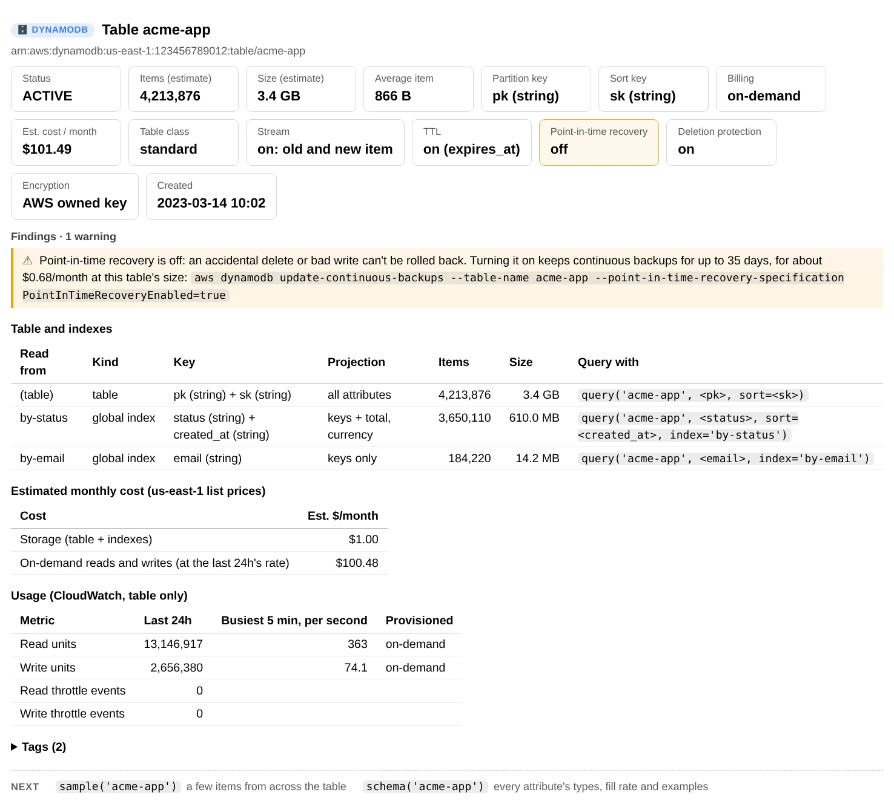
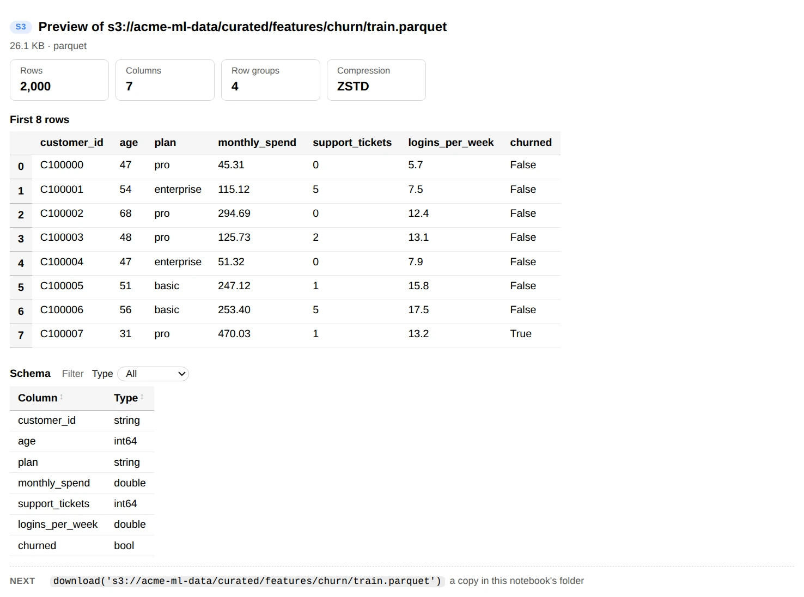
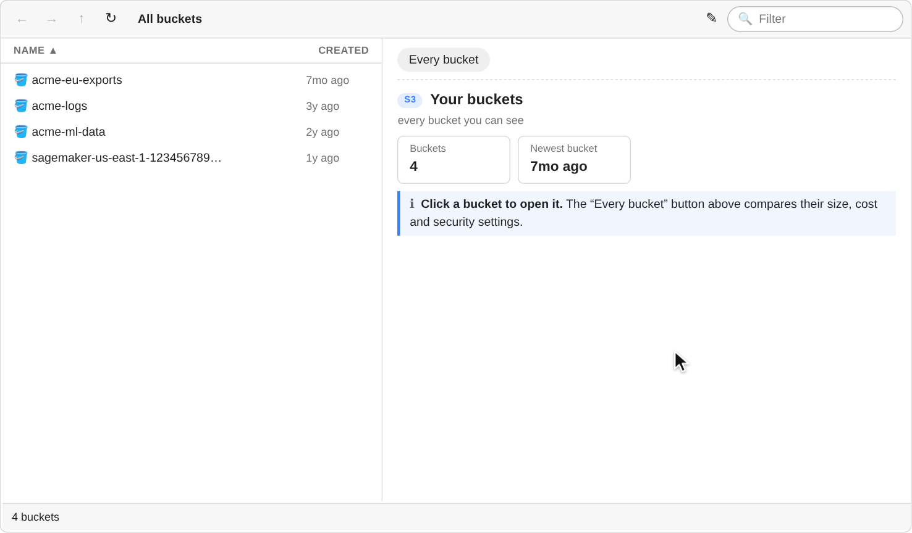
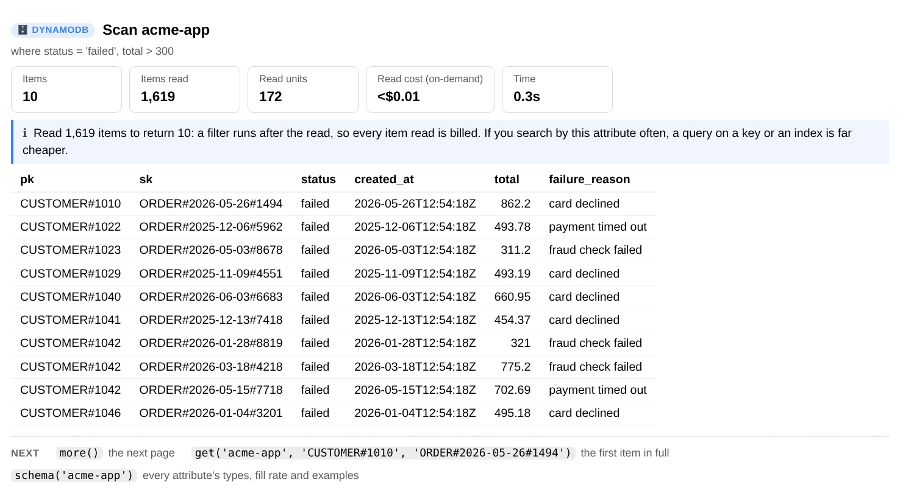
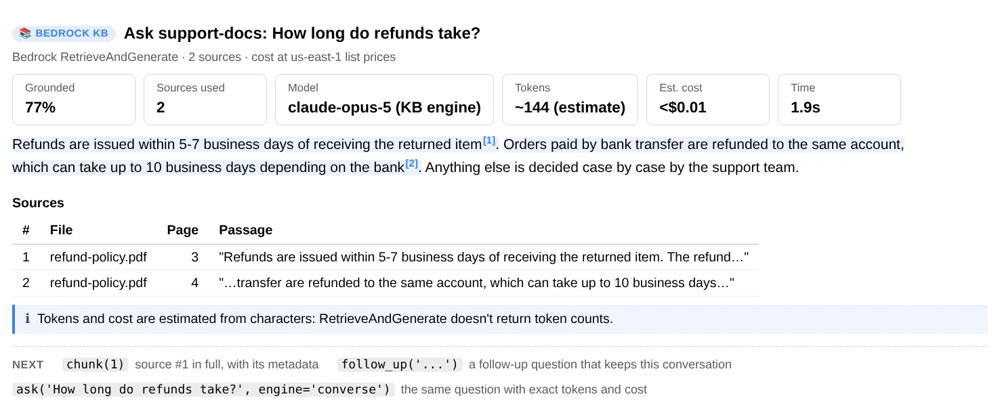
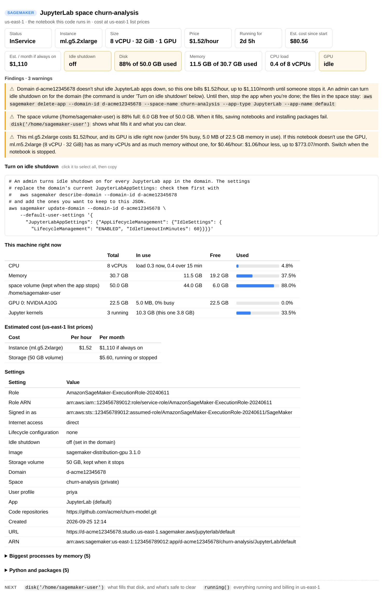

<div align="center">


# aws-analyzer

**Understand your AWS data from a SageMaker notebook.**

One Python file per AWS service. Drop it next to your notebook and get readable reports on your S3 buckets,
DynamoDB tables, Bedrock knowledge bases and the SageMaker notebook itself: what's there, what it costs, and what to
do next.

[](https://github.com/utkarsh5026/aws-analyzer/actions/workflows/ci.yml)
[](https://pypi.org/project/aws-analyzer/)
[](.github/workflows/ci.yml)
[](#get-started)
[](#why-aws-analyzer)
[](LICENSE)

**[Guides](https://utkarsh5026.github.io/aws-analyzer/)** · [Get started](#get-started) · [S3](#amazon-s3) ·
[DynamoDB](#amazon-dynamodb) · [Bedrock Knowledge Bases](#amazon-bedrock-knowledge-bases) ·
[SageMaker](#amazon-sagemaker) · [Development](#development)

</div>

<br>

<picture>
  <source media="(prefers-color-scheme: dark)" srcset="docs/images/overview-dark.webp">
  
</picture>

<p align="center"><sub><code>ui.overview()</code>: every bucket's size, estimated monthly cost and security settings, what's wrong with each, and what to run next.</sub></p>

## Why aws-analyzer

<table>
<tr>
<td width="33%" valign="top">
<b>🧭 The answer first</b><br>
Each report starts with the few numbers that matter, then explains the rest in plain English: bucket policies,
lifecycle rules, knowledge base settings. The raw JSON is still there, folded away.
</td>
<td width="33%" valign="top">
<b>💵 Findings you can act on</b><br>
Each warning says what's wrong, why it matters and what it costs ("costing $12.40/month"), then the next step.
Reports end with the commands worth running next, arguments filled in.
</td>
<td width="33%" valign="top">
<b>🧾 Honest about cost</b><br>
Estimates are labelled as estimates, with the prices used. Expensive scans stop early by default and say so, and
show what they read or cost.
</td>
</tr>
<tr>
<td width="33%" valign="top">
<b>📄 One file, boto3 only</b><br>
Copy one file next to your notebook (no file depends on another), or <code>pip install aws-analyzer</code>. pandas,
pyarrow and the rest are optional.
</td>
<td width="33%" valign="top">
<b>🔒 Read-only</b><br>
Nothing writes to a bucket, table or knowledge base. Where a change would help, the report shows the command (a
restore, a sync, a lifecycle rule) instead of running it.
</td>
<td width="33%" valign="top">
<b>💬 Notes, not tracebacks</b><br>
A missing permission, package or broken file becomes a short note that says how to fix it, and the rest of the
report still renders.
</td>
</tr>
</table>

## Services

| Service                            | What it shows you                                                                                                                                                                                                                          | File and guide                                                                                                                            |
| :--------------------------------- | :----------------------------------------------------------------------------------------------------------------------------------------------------------------------------------------------------------------------------------------- | :---------------------------------------------------------------------------------------------------------------------------------------- |
| **Amazon S3**                      | • Every bucket's size, monthly cost and risks<br>• Click through folders like a file explorer, or search them<br>• Preview CSV, Parquet, JSON, Excel, PDF, Word and more<br>• Cut storage costs and recover deleted files                  | [`s3.py`](analyzers/s3.py), [`s3_explorer.py`](analyzers/s3_explorer.py)<br>[Guide →](https://utkarsh5026.github.io/aws-analyzer/s3.html) |
| **Amazon DynamoDB**                | • Every table's key, size, billing and cost<br>• Scan, query and get items as plain tables<br>• Which attributes the items hold, and their types<br>• The read units each report used; scans stop early                                    | [`dynamodb.py`](analyzers/dynamodb.py)<br>[Guide →](https://utkarsh5026.github.io/aws-analyzer/dynamodb.html)                             |
| **Amazon Bedrock Knowledge Bases** | • Settings in plain English, sync health and failed documents<br>• Search with sources, pages and highlighted passages<br>• Answers with each claim linked to its source<br>• Compare search settings and measure retrieval hit rate       | [`bedrock_kb.py`](analyzers/bedrock_kb.py)<br>[Guide →](https://utkarsh5026.github.io/aws-analyzer/bedrock_kb.html)                       |
| **Amazon SageMaker**               | • The notebook you're in: type, cost so far, idle shutdown<br>• Its CPU, memory, disk and GPU use right now<br>• What fills the disk, and what's safe to clear<br>• Everything running and billing in the region, and what looks forgotten | [`sagemaker_env.py`](analyzers/sagemaker_env.py)<br>[Guide →](https://utkarsh5026.github.io/aws-analyzer/sagemaker_env.html)              |

The [guides](https://utkarsh5026.github.io/aws-analyzer/) walk through each service with screenshots: setting up in
SageMaker, every command, and ready-made IAM policies. Their source is in [`docs/`](docs/).

## Get started

**1. Install it, or put the file next to your notebook.** Pick whichever works where you are:

- **Install it with pip**, in a notebook cell: `%pip install aws-analyzer`. That's every service, and only needs
  boto3; `%pip install "aws-analyzer[all]"` also installs every optional package (pandas, pyarrow, the PDF and Excel
  readers, progress bars). Then import from `aws_analyzer` instead of from the file (step 2).
- **Upload it:** download [`analyzers/s3.py`](analyzers/s3.py) and drag it into JupyterLab's file browser, in the same
  folder as your notebook.
- **Fetch it from a cell**, if the notebook can reach the internet:
  ```python
  !curl -sO https://raw.githubusercontent.com/utkarsh5026/aws-analyzer/main/analyzers/s3.py
  ```
- **Copy it from S3**, for a notebook with no internet access (VPC-only mode): upload it to a bucket once, then run
  `!aws s3 cp s3://your-bucket/tools/s3.py .`
- **Or paste** the whole file into a notebook cell and run it.

**2. Import it and look around.** It uses the notebook's IAM execution role, so there's nothing to configure:

```python
from s3 import S3View  # or DynamoDBView from dynamodb, BedrockKBView from bedrock_kb, SageMakerView from sagemaker_env
# installed with pip: from aws_analyzer import S3View (or DynamoDBView, BedrockKBView, SageMakerView, S3Explorer)

ui = S3View()          # uses the notebook's IAM role
ui.help()              # every command, grouped by task; ui.help("summary") shows one in full
ui.overview()          # every bucket: size, monthly cost, security warnings
s3 = ui.core           # the analyzer behind the view: returns data instead of a report
```

> [!NOTE]
> Only boto3 is required, and SageMaker already has it. pandas, pyarrow and the other packages are optional: a
> command that needs one that isn't installed says which to install instead of failing.
>
> Installed with pip, every `from s3 import ...` in this README and the guides becomes
> `from aws_analyzer.s3 import ...` (the same for `dynamodb`, `bedrock_kb`, `sagemaker_env` and `s3_explorer`). The
> Analyzer and View classes also come straight from `aws_analyzer`.

<details>
<summary><b>Options</b>: another profile or region, plain text, longer tables, progress bars</summary>

```python
from s3 import S3Analyzer, S3View

ui = S3View(S3Analyzer(profile="dev", region="eu-west-1"))   # another AWS profile or region
ui = S3View(mode="text")          # plain text, e.g. in a terminal or a script
ui = S3View(max_rows=0)           # show every row of long tables (default: 50)
ui = S3View(progress="plain")     # a plain progress line instead of tqdm bars ("off" for none)
```

Every View takes the same options. Commands that take a while show a progress bar as they run: a
[tqdm](https://github.com/tqdm/tqdm) bar (a widget in Jupyter when `ipywidgets` is installed) with the rate and the
time left, when tqdm is installed, as it usually is on SageMaker. Without it you get a plain line with the same
numbers.

</details>

## How it works

Every file has the same two layers:

| Layer     | Class                                                                      | What it does                                                                                                                  |
| :-------- | :------------------------------------------------------------------------- | :---------------------------------------------------------------------------------------------------------------------------- |
| **Logic** | `S3Analyzer`, `DynamoDBAnalyzer`, `BedrockKBAnalyzer`, `SageMakerAnalyzer` | Calls AWS, returns plain Python data (dataclasses, dicts, lists, DataFrames). Never prints.                                   |
| **UI**    | `S3View`, `DynamoDBView`, `BedrockKBView`, `SageMakerView`                 | Wraps the analyzer and renders readable cards, bar tables and previews in the notebook (HTML in Jupyter, text in a terminal). |

### Reading a report

Every report has the same shape, so the answer is always in the same place:

1. **Title and cards**: the few numbers that matter. A card turns amber (or red) when a finding below is about it,
   such as `Encryption: none` or `Point-in-time recovery: off`. In text mode those cards end in `(!)`.
2. **Findings**: what's wrong or worth knowing, warnings first. Each says why it matters, what it costs when that can
   be priced, and the next step. When every check passes, the report says so.
3. **Tables of detail.** Status cells such as `FAILED` or `PUBLIC` are coloured. Long tables scroll under a fixed
   header, and secondary views (tags, the raw policy JSON) are folded: click to open them.
4. **Next**: two or three commands worth running next, with the arguments filled in from this report, such as
   `get('orders', 'USER#0', 'ORDER#0000')` after a scan or `chunk(1)` after a search.

<picture>
  <source media="(prefers-color-scheme: dark)" srcset="docs/images/dynamodb-table-info-dark.webp">
  
</picture>

<p align="center"><sub><code>ui.table_info("acme-app")</code>: the point-in-time recovery card is amber because the finding below is about it, and the finding ends in the command that turns it on.</sub></p>

In the notebook, one click on a command anywhere in a report (`documents(status='FAILED')`,
`aws dynamodb update-table ...`) or on a code block (a restore call, a lifecycle rule, a sync command) selects all of
it, ready to copy. The HTML is plain HTML and CSS, with no JavaScript, so a report still works when the notebook is
reopened. `ui.help()` lists every command grouped by task, with a few to start with; `ui.help("summary")` shows one
command's full description.

## Amazon S3

**Buckets and the files in them.** Every bucket's size, cost and risks, what's in a folder, a look inside the files,
and what you could save.

📄 [`analyzers/s3.py`](analyzers/s3.py) · 📖 [S3 guide](https://utkarsh5026.github.io/aws-analyzer/s3.html)

<picture>
  <source media="(prefers-color-scheme: dark)" srcset="docs/images/preview-parquet-dark.webp">
  
</picture>

<p align="center"><sub><code>ui.preview()</code> of a Parquet file: row, column and row-group counts, the first rows and the schema, reading only what it needs.</sub></p>

### Quick start

Install the packages first, in a notebook cell (in a terminal, drop the `%`). On SageMaker the first line is already
installed, so you only need the second one, and only for the file types it lists.

```python
%pip install boto3 pandas pyarrow      # the commands below
# optional: Excel, PDF text and pages, .zst, snappy Avro, progress bars
%pip install openpyxl xlrd pypdf pypdfium2 pillow zstandard python-snappy tqdm
# or, with pip instead of the file: all of the above and s3.py itself
%pip install "aws-analyzer[all]"
```

<details>
<summary><b>What each package is for</b></summary>

| Package                | Needed for                                                                                                                                                                        |
| :--------------------- | :-------------------------------------------------------------------------------------------------------------------------------------------------------------------------------- |
| `boto3`                | Every command (required)                                                                                                                                                          |
| `pandas`               | Tables in `preview` (CSV, JSON, Avro, Excel, NumPy), `read_df`, `objects_to_df`, `to_df()`. Installs `numpy` for `.npy` / `.npz`                                                  |
| `pyarrow`              | `.parquet`, `.orc`, `.feather`, `.arrow` in `preview`, `read_df` and `file_details`, and `parquet_info`                                                                           |
| `openpyxl` / `xlrd`    | Excel `.xlsx` / `.xlsm` and old `.xls`                                                                                                                                            |
| `pypdf`                | PDF text in `preview`, `document`, `read_pdf`, and page counts in `file_details`                                                                                                  |
| `pypdfium2` + `pillow` | PDF pages drawn as pictures, the way they print (scanned pages too), in `preview`, `document`, `render_pdf`. `pillow` also shrinks big pictures in Word files before showing them |
| `zstandard`            | `.zst` files before Python 3.14                                                                                                                                                   |
| `python-snappy`        | Avro files compressed with snappy                                                                                                                                                 |
| `tqdm`                 | Progress bars with the time left while long commands run (`ipywidgets` makes them notebook widgets). Without it, a plain progress line                                            |

IPython, used for the HTML output, comes with Jupyter. If a package is missing, the command tells you which one to
install instead of failing; install it and run the cell again.

</details>

```python
from s3 import S3View

ui = S3View()                # uses the notebook's execution role
ui.help()                    # every command, grouped by task
ui.help("summary")           # one command in full

ui.overview()                # every bucket: size, monthly cost, security warnings
ui.bucket_info("my-bucket")
ui.summary("s3://my-bucket/data/")
ui.preview("s3://my-bucket/data/part-0.parquet")
ui.what_if("s3://my-bucket/logs/", move_after=30, to="STANDARD_IA")  # preview a lifecycle rule
```

> [!TIP]
> Anywhere a location is expected you can pass `s3://bucket/prefix` or `bucket/prefix`. Sizes accept `1024`,
> `"10MB"`, `"1.5GB"`; times accept a `datetime`, `"2024-05-01"`, or relative `"7d"`, `"12h"`.

### Browse like a file explorer

[`s3_explorer.py`](analyzers/s3_explorer.py) turns a cell into a small file explorer for S3. Folders and files are
listed on the left. Click a folder to open it, or click a file to see what's inside it on the right, drawn by the
same `preview` as above: a table's first rows, a PDF's pages, a Word file with its pictures, an archive's contents.

<picture>
  <source media="(prefers-color-scheme: dark)" srcset="docs/images/explorer-tour-dark.webp">
  
</picture>

<p align="center"><sub><code>S3Explorer()</code>: from your buckets to a Parquet file's first rows and a Word document, one click at a time.</sub></p>

It builds on `s3.py`, so put **both files** next to your notebook, or paste `s3.py` into a cell and `s3_explorer.py`
into the next one. Clicking needs `ipywidgets`, which SageMaker notebooks already have.

```python
from s3_explorer import S3Explorer

S3Explorer()                                   # start from your buckets
S3Explorer("s3://my-bucket/data/")             # or in a folder; S3 console links work too
S3Explorer("s3://my-bucket/data/report.pdf")   # a file's folder, with the file shown
```

| To                   | Do this                                                                                                                                                                                                               |
| :------------------- | :-------------------------------------------------------------------------------------------------------------------------------------------------------------------------------------------------------------------- |
| Open a folder        | Click it. **←** **→** **↑** go back, forward and up, and each part of the path at the top opens that folder                                                                                                           |
| See what's in a file | Click it. **Details** shows its metadata and tags, **Read all** a whole PDF, Word or PowerPoint file, **⬇ Download** saves a copy next to your notebook, and **🔗 Link** makes a download link that works for an hour |
| Go to a path         | Click **✎**, paste an `s3://` path or an S3 console link, and press Enter                                                                                                                                             |
| Narrow a long folder | Type in **Filter** (`*.csv` patterns work too). Click **Name**, **Size** or **Modified** to sort; sizes and dates sort biggest and newest first                                                                       |
| Add up a folder      | Open it and click **What's in here**: every file below it, with sizes, types, cost and findings (the `summary` report)                                                                                                |

Each folder is listed 1,000 entries per request and shown 100 rows at a time. In a bigger folder, **Load more**
lists the next 1,000, and **Look up** asks S3 for the names that start with what you typed in the filter. Files in
GLACIER or DEEP_ARCHIVE are marked ❄, and opening one shows the command that restores it. Like `s3.py`, it only
reads: browsing needs `s3:ListAllMyBuckets` and `s3:ListBucket`, and opening files `s3:GetObject`.

<details>
<summary><b>Options, and using it from code</b></summary>

```python
from s3 import S3Analyzer
from s3_explorer import S3Explorer, S3Navigator

S3Explorer("s3://my-bucket/", profile="dev")          # another AWS profile (or region=)
S3Explorer(core=S3Analyzer(region="eu-west-1"))       # an S3Analyzer or S3View you already have
S3Explorer(height=720, page_size=200)                 # taller panes, more rows before "Show more"

x = S3Explorer("s3://my-bucket/")
x.open("s3://my-bucket/raw/"); x.back(); x.up(); x.refresh()   # the toolbar, from code
x.ui.summary(x.location)                              # any S3View report about where you are, in its own cell

nav = S3Navigator()                                   # the same navigation as data, with no UI
folder = nav.open("s3://my-bucket/data/")             # Folder: entries, more, error
nav.more(), nav.back(), nav.up(), nav.lookup("2024-")
```

Outside Jupyter, without `ipywidgets`, or with `mode="text"`, each folder prints as a table and `open(...)` moves
around. The pure functions work on their own: `parse_location` (s3:// paths, `bucket/key`, console links and object
URLs), `breadcrumbs`, `parent_uri`, `sort_entries` (folders first, `part-2` before `part-10`), `filter_entries` and
`folder_stats`.

</details>

### Commands (`S3View`)

Grouped the way `ui.help()` lists them.

#### Buckets

| Command                | Shows                                                                                                                                                                                                                                                                                                                                 |
| :--------------------- | :------------------------------------------------------------------------------------------------------------------------------------------------------------------------------------------------------------------------------------------------------------------------------------------------------------------------------------ |
| `buckets()`            | All buckets with region, creation date, age                                                                                                                                                                                                                                                                                           |
| `overview(match=None)` | Every bucket in one table: objects, size, estimated monthly cost, versioning, encryption, public access, lifecycle rules, and a list of warnings. `match="sagemaker-*"` checks only matching names                                                                                                                                    |
| `bucket_info(bucket)`  | Versioning, encryption, public access (bucket and account level), bucket policy and lifecycle rules in plain English, ownership, object lock, replication, logging, inventory, tags, **plus CloudWatch object count, size and estimated monthly cost per storage type** (instant, even for billion-object buckets), and flagged risks |
| `policy(bucket)`       | The bucket policy in plain English (who can do what, on which files, under which conditions), its risks (public access, other accounts, no HTTPS requirement) and the raw JSON                                                                                                                                                        |

#### Explore a folder

| Command                                                                                                               | Shows                                                                                                                                                                                                                                                                                                                                                                                                                                                                                            |
| :-------------------------------------------------------------------------------------------------------------------- | :----------------------------------------------------------------------------------------------------------------------------------------------------------------------------------------------------------------------------------------------------------------------------------------------------------------------------------------------------------------------------------------------------------------------------------------------------------------------------------------------- |
| `ls(uri, details=False)`                                                                                              | One level of folders and files, like `aws s3 ls`. `details=True` adds what's inside each file: a PDF's pages, a table's rows and columns, a picture's size                                                                                                                                                                                                                                                                                                                                       |
| `tree(uri, depth=2, files=10)`                                                                                        | Folder tree with count, size and share at every level, and the files in each folder (the first `files` by name, then one "… N more files" row; `files=0` for folders only)                                                                                                                                                                                                                                                                                                                       |
| `summary(uri)`                                                                                                        | Dashboard: totals, estimated monthly cost, folder breakdown, file types, storage classes, size and age histograms, largest objects, and findings (small-file problem, archived objects, cold data in STANDARD and what moving it would save, files under 128 KB billed as 128 KB, empty files)                                                                                                                                                                                                   |
| `find(uri, pattern=, regex=, extensions=, min_size=, max_size=, modified_after=, modified_before=, storage_classes=)` | Search by glob, regex, extension, size, date or storage class, e.g. `find(uri, pattern="*.csv", min_size="10MB", modified_after="7d")`                                                                                                                                                                                                                                                                                                                                                           |
| `file_details(uri, pattern=, extensions=, limit=200, max_read="1GB")`                                                 | What's inside each file, a table per kind (see [what it reports](#file-details)): a PDF's pages, title, author and whether it has text, a Word file's words, a deck's slides, each Excel sheet's size, a table's rows and column names, a picture's size, a video's length, an archive's files. Findings: scanned PDFs that need OCR, password-protected files, files that aren't what their name says, table files in one folder with different columns. Reads only the parts each format needs |
| `largest(uri)` / `newest(uri)` / `oldest(uri)`                                                                        | The top-N objects under a prefix: the biggest, the newest or the oldest                                                                                                                                                                                                                                                                                                                                                                                                                          |
| `compare(uri_a, uri_b)`                                                                                               | Diff two prefixes: identical / different / only in A / only in B (to verify a copy or sync)                                                                                                                                                                                                                                                                                                                                                                                                      |

#### Cut cost

| Command                                                       | Shows                                                                                                                                                                                                                                                                                                                                                                                                                                                                                                                                                                                                    |
| :------------------------------------------------------------ | :------------------------------------------------------------------------------------------------------------------------------------------------------------------------------------------------------------------------------------------------------------------------------------------------------------------------------------------------------------------------------------------------------------------------------------------------------------------------------------------------------------------------------------------------------------------------------------------------------- |
| `duplicates(uri, method="hash", min_size=1, max_read="10GB")` | Identical files, the space and monthly cost of their copies, which copy to keep, and folders that hold nothing but copies (e.g. a backfill of files that exist elsewhere), plus the call that gets the list as a DataFrame. Files are matched by size and ETag, and where same-size files have different ETags (copies uploaded in parts of another size, or encrypted with SSE-KMS), by the SHA-256 of their content: the first 64 KB first, the whole file only where those match, reading at most `max_read`. `method="etag"` reads nothing; `method="strict"` hashes every file that shares its size |
| `what_if(uri, move_after=, to=, delete_after=)`               | Preview a lifecycle rule before adding it: how many files it would move or delete today, cost before and after, one-time cost and payback time, plus the rule's JSON. `move_after={30: "STANDARD_IA", 180: "GLACIER"}` for several moves                                                                                                                                                                                                                                                                                                                                                                 |
| `uploads(uri)`                                                | Incomplete multipart uploads (billed but invisible in normal listings) and what they cost                                                                                                                                                                                                                                                                                                                                                                                                                                                                                                                |

#### Versions and deleted files

| Command                            | Shows                                                                                                                                                                                             |
| :--------------------------------- | :------------------------------------------------------------------------------------------------------------------------------------------------------------------------------------------------ |
| `versions(uri)`                    | Current vs noncurrent versions, delete markers, what the old versions cost per month, keys holding the most old-version data                                                                      |
| `history(uri)`                     | Version history of one object                                                                                                                                                                     |
| `deleted(uri, deleted_after=None)` | Deleted files you can still bring back in a versioned bucket (most recent first), their size, the old versions kept, and the call that restores one. Read-only: it never restores anything itself |

#### Open a file

| Command                                                                           | Shows                                                                                                                                                                                                                                                                                                                                                                                                                                                                                                                     |
| :-------------------------------------------------------------------------------- | :------------------------------------------------------------------------------------------------------------------------------------------------------------------------------------------------------------------------------------------------------------------------------------------------------------------------------------------------------------------------------------------------------------------------------------------------------------------------------------------------------------------------ |
| `head(uri)`                                                                       | All object metadata, user metadata and tags                                                                                                                                                                                                                                                                                                                                                                                                                                                                               |
| `preview(uri, n=20)`                                                              | Looks inside a file (see [file types](#file-types)): tables as a DataFrame with their schema, the files in an archive, tensors, notebook cells, pretty JSON, text, images, an audio / video player, a PDF's first pages as they look (scans too), a Word file with its pictures in place, or a hex dump. Only downloads what it needs.                                                                                                                                                                                    |
| `document(uri, pages=None, pictures=None)`                                        | A PDF, Word `.docx` or PowerPoint `.pptx` as it reads: a Word file with its headings, lists, tables and pictures in place, a PDF or deck page by page or slide by slide. PDF pages with no text (scans) are drawn as pictures; `pictures=True` draws every page. PDFs need `pypdf`, and `pypdfium2` + `pillow` to draw pages                                                                                                                                                                                              |
| `download(uri, path=None)`                                                        | Downloads a file, or a whole folder with its sub-folders, with a progress bar, and says where it went. Files already there with the same size and time are skipped, so running it again resumes. GLACIER files are listed as needing a restore, and it refuses when the disk hasn't room. For a table file it shows the pandas call that opens it                                                                                                                                                                         |
| `download_zip(uri, path=None, max_size="100MB", max_files=10_000, dry_run=False)` | A file or folder as one `.zip` on the notebook's disk, but first a check of whether this notebook can make it: the files fit the size limit (100 MB by default) and file count, the disk has room, memory, and the role can read them (one 1-byte read). If a check fails nothing is downloaded, and the report says what to change (e.g. the `max_size=` that would fit). `dry_run=True` only runs the checks. GLACIER files are left out and listed; parquet, gz and images are stored as they are, the rest compressed |
| `link(uri)`                                                                       | Clickable presigned download link                                                                                                                                                                                                                                                                                                                                                                                                                                                                                         |

### Reference

<details>
<summary><b>Getting the data</b> (<code>S3Analyzer</code>): the same answers as Python data, for pandas and your own code</summary>

`ui.core` is the `S3Analyzer`. Every UI command has a data method on it, and there are a few more:

```python
s3 = ui.core                                        # or S3Analyzer(region="us-east-1", profile="dev")

summary = s3.summarize("s3://my-bucket/data/")      # PrefixSummary dataclass
summary.by_extension["parquet"].size                # bytes

files = s3.find("s3://my-bucket/data/", extensions=["csv"], modified_after="7d")
df = objects_to_df(files)                           # key, size, last_modified, storage_class, ...

df = s3.read_df("s3://my-bucket/data/big.parquet", nrows=1000, columns=["id", "ts"])
df = s3.read_df("s3://my-bucket/reports/q1.xlsx", sheet_name="Summary")
df = s3.read_df("s3://my-bucket/spark/part-00000", fmt="parquet")   # no extension: say what it is
s3.parquet_info("s3://my-bucket/data/big.parquet")  # rows, row groups, schema (reads only the footer)
s3.list_archive("s3://my-bucket/job/output/model.tar.gz").entries   # files inside, without extracting
details = s3.file_details("s3://my-bucket/docs/", extensions="pdf")   # FileDetailsReport: .files, bytes_read
details.to_df()                                     # one row per file: format, size, summary, pages, title, rows, ...
s3.describe_objects(s3.find("s3://my-bucket/", min_size="1GB"))     # the same, for files you picked
s3.read_avro("s3://my-bucket/events.avro", n=100), s3.read_npy(uri, nrows=10), s3.safetensors_info(uri)
doc = s3.read_document("s3://my-bucket/docs/policy.pdf")   # also .docx / .pptx: doc.text, doc.parts, doc.title
s3.read_pdf(uri, pages=[1, 2]), s3.read_docx(uri).headings, s3.read_pptx(uri).notes
pages = s3.render_pdf(uri, pages=[1, 2])            # [Picture]: each one shows itself in a notebook; .data is PNG / JPEG
s3.read_docx(uri, pictures=True).pictures           # the pictures in a Word file, in reading order
s3.read_lines("s3://my-bucket/logs/app.log.gz", 50)
s3.read_json(...), s3.read_jsonl(..., n=100), s3.read_text(...), s3.read_bytes(uri, 0, 1023)
with s3.open("s3://my-bucket/data/x.csv.gz") as f: ...   # streaming, decompressed

for obj in s3.iter_objects("s3://my-bucket/"):      # stream a listing without holding it in memory
    ...

reports = s3.bucket_reports(match="sagemaker-*")    # BucketConfig + CloudWatch size per bucket
explain_policy(s3.bucket_policy("my-bucket"), s3.account_id())   # [PolicyStatement], plain English
impact = s3.simulate_lifecycle("s3://my-bucket/logs/", move_after=30, to="STANDARD_IA")
impact.monthly_savings, impact.rule()               # USD per month, the rule as a dict
s3.deleted_files("s3://my-bucket/data/", deleted_after="7d").files   # [DeletedObject]
dupes = s3.find_duplicates("s3://my-bucket/data/")  # DuplicateReport: groups, copies, reclaimable, monthly_cost
dupes.to_df()                                       # one row per file: group, role ('keep' / 'copy'), key, sha256, ...
s3.download_folder("s3://my-bucket/data/", "data")  # FolderDownload; s3.download(uri, path) for one file
plan = s3.plan_zip("s3://my-bucket/data/")          # ZipPlan: files, size, disk / memory free, can_download
s3.download_zip("s3://my-bucket/data/", max_size="1GB").plan.path   # ZipDownload; nothing written if a check fails
```

The aggregation functions are pure (no AWS calls), so they also work on your own lists of `ObjectInfo`,
for example rows loaded from an S3 Inventory report: `summarize_objects`, `build_folder_tree`,
`make_filter`, `find_duplicate_groups`, `compare_objects`, `simulate_lifecycle_objects`, `summary_findings`,
`bucket_findings`, `explain_policy`, `policy_findings`, `object_monthly_cost`, `cloudwatch_cost`, the duplicate
finder's steps (`files_to_hash` says which files need reading, `group_duplicates` groups them given the hashes you
have, then `duplicate_folders` and `duplicate_findings`), `zip_checks` and `zip_findings` (on a `ZipPlan`), and the
file parsers `parse_docx` (`pictures=True` for its pictures), `parse_pptx`, `parse_pdf`, `parse_avro`, and
`render_pdf_pages`, which draws a PDF's pages from a local file or bytes. `describe_file("local.pdf")` (or a binary file
object and its name) says what's inside a file the way `file_details` does, and `file_details_findings` works on a
`FileDetailsReport`.

</details>

<details>
<summary><a name="file-types"></a><b>File types</b>: what <code>preview</code> and <code>read_df</code> can open</summary>

`preview` and `read_df` pick the reader from the file name, and from the first bytes when the name has
no extension or the wrong one (Spark's `part-00000`, a Firehose object, a `.gz` that isn't gzipped).

| Kind                 | Extensions                                                                   | `preview` shows                                                                                                                                                   | `read_df`          |
| :------------------- | :--------------------------------------------------------------------------- | :---------------------------------------------------------------------------------------------------------------------------------------------------------------- | :----------------- |
| Delimited text       | `.csv` `.tsv` `.psv`                                                         | first rows                                                                                                                                                        | ✓                  |
| JSON                 | `.json` `.jsonl` `.ndjson`                                                   | table of records, or pretty JSON                                                                                                                                  | ✓                  |
| Columnar             | `.parquet` `.orc` `.feather` `.arrow`                                        | first rows, schema, row count (reads only what it needs)                                                                                                          | ✓                  |
| Avro                 | `.avro`                                                                      | first rows, schema, codec (built-in reader; snappy needs `python-snappy`)                                                                                         | ✓                  |
| Excel                | `.xlsx` `.xlsm` `.xls`                                                       | sheet names, first rows (needs `openpyxl`; `.xls` needs `xlrd`)                                                                                                   | ✓ `sheet_name=`    |
| NumPy                | `.npy` `.npz`                                                                | shape, dtype, first rows / the arrays inside                                                                                                                      | ✓ `.npy` up to 2-D |
| Archives             | `.zip` `.tar` `.tar.gz` `.tgz`                                               | the files inside, e.g. a SageMaker `model.tar.gz`                                                                                                                 |                    |
| Models               | `.safetensors` `.pt` `.pth` `.ckpt` `.pkl` `.joblib`                         | tensors, shapes, parameter count / files inside; pickles are never loaded                                                                                         |                    |
| Notebooks            | `.ipynb`                                                                     | kernel and cells                                                                                                                                                  |                    |
| Images, audio, video | `.png` `.jpg` `.gif` `.webp` / `.wav` `.mp3` `.flac` / `.mp4` `.webm` `.mov` | the image / a player                                                                                                                                              |                    |
| PDF                  | `.pdf`                                                                       | the first 3 pages as they look, scanned pages too (needs `pypdfium2` + `pillow`), page count, title and first page's text (needs `pypdf`); without either, a link |                    |
| Word                 | `.docx` `.docm` `.dotx`                                                      | the first paragraphs laid out with their headings, lists, tables and pictures in place; word count (no package needed)                                            |                    |
| PowerPoint           | `.pptx` `.pptm` `.ppsx`                                                      | every slide's title and text, speaker notes (no package needed)                                                                                                   |                    |
| Old Office           | `.doc` `.ppt` `.msg`                                                         | recognised, with how to convert them (the old binary format can't be read)                                                                                        |                    |
| Text                 | `.txt` `.log` `.md` `.yaml` `.xml` `.sql` `.py` and more                     | first lines                                                                                                                                                       |                    |

Any of them can also be compressed: `.gz`, `.bz2`, `.xz`, or `.zst` (Python 3.14+, or `pip install zstandard`).
Packages in the table are optional; without them `preview` says what to install.

</details>

<details>
<summary><a name="file-details"></a><b>File details</b>: what <code>file_details</code> and <code>ls(details=True)</code> report for each kind of file</summary>

Each file's format comes from its name and is checked against its first bytes, so a file with no extension is still
described and one with the wrong extension is flagged ("report.pdf is text, not a PDF"). Counts marked `≈` are
estimates from the start of the file, and `+` marks a lower bound.

| Kind            | Extensions                                       | Reports                                                                                                                                                                                       | Reads                                           |
| :-------------- | :----------------------------------------------- | :-------------------------------------------------------------------------------------------------------------------------------------------------------------------------------------------- | :---------------------------------------------- |
| PDF             | `.pdf`                                           | pages, whether the first 3 pages have text (none = probably scanned), page size (A4, Letter, …), title, author, the app that made it, creation date, PDF version, whether it needs a password | the page tree and first 3 pages (needs `pypdf`) |
| Word            | `.docx` `.docm` `.dotx`                          | words, pages (as Word last saved them), headings, tables, pictures, title, author, last saved                                                                                                 | the document's text                             |
| PowerPoint      | `.pptx` `.pptm` `.ppsx`                          | slides, words, slides with speaker notes, tables, pictures, title, author                                                                                                                     | the slides' text                                |
| Excel           | `.xlsx` `.xlsm`                                  | each sheet's name and rows × columns, title, author                                                                                                                                           | the size saved at the top of each sheet         |
| Parquet         | `.parquet`                                       | rows, column names, row groups, compression, the program that wrote it                                                                                                                        | the footer (needs `pyarrow`)                    |
| ORC, Feather    | `.orc` `.feather` `.arrow`                       | rows, column names, compression, stripes / record batches                                                                                                                                     | the metadata (needs `pyarrow`)                  |
| Avro            | `.avro`                                          | rows, column names, codec                                                                                                                                                                     | block headers, in files up to 64 MB             |
| CSV, JSON lines | `.csv` `.tsv` `.psv` `.jsonl` `.ndjson`          | column names, rows: exact up to 256 KB, then `≈` estimated, or `+` when compressed                                                                                                            | the first 256 KB                                |
| JSON            | `.json`                                          | records and their keys, or an object's keys                                                                                                                                                   | up to 16 MB                                     |
| Pictures        | `.png` `.jpg` `.gif` `.bmp` `.webp`, TIFF        | format, width × height                                                                                                                                                                        | the first 64 KB                                 |
| Audio, video    | `.wav` `.flac` `.mp4` `.mov` `.m4a`              | length; sample rate and channels; width × height                                                                                                                                              | the header / the MP4 `moov` box                 |
| Archives        | `.zip` `.tar` `.tar.gz` `.tgz`                   | files inside, unpacked size                                                                                                                                                                   | the zip index / tar headers                     |
| Models, arrays  | `.safetensors` `.npy` `.npz` `.pt` `.pth` `.pkl` | tensors, parameters, dtypes / shape / arrays / files inside; pickles are never loaded                                                                                                         | headers only                                    |
| Notebooks       | `.ipynb`                                         | cells, code cells, outputs, kernel                                                                                                                                                            | up to 50 MB                                     |
| Text            | `.txt` `.log` `.md` and more                     | lines                                                                                                                                                                                         | the first 256 KB                                |

</details>

<details>
<summary><b>Cost estimates</b>: storage only, at us-east-1 list prices, or yours</summary>

Costs are storage only (no requests, retrievals or data transfer), at us-east-1 list prices for the first
50 TB (`S3_PRICES`). They follow S3's billing rules: STANDARD_IA, ONEZONE_IA and GLACIER_IR bill at least
128 KB per object, and GLACIER / DEEP_ARCHIVE add 40 KB of index data per object. Listings don't say which
Intelligent-Tiering tier an object is in, so it's priced at the frequent-access rate; CloudWatch does, so
`bucket_info` and `overview` price each tier. For another region, pass your prices:

```python
ui = S3View(S3Analyzer(prices={"STANDARD": 0.025, "STANDARD_IA": 0.0138}))
```

</details>

<details>
<summary><b>Large buckets</b>: how long each command takes on millions of objects, and what to run first</summary>

- `summary`, `tree`, `find`, `duplicates` and `compare` list every key under the prefix (1,000 per request),
  so expect about 1 to 3 minutes per million objects. A progress bar shows while they run. Pass `limit=` to sample.
- `duplicates` also downloads files that share a size but not an ETag: 64 KB of each, then whole files only where
  those match, 16 at a time, biggest possible saving first, and it stops at `max_read` (10 GB by default). It
  says how much it read. That download is free inside the bucket's region; from outside AWS it's billed as data
  transfer. `method="etag"` reads nothing.
- `download_zip` counts at most `max_files` keys (10,000 by default) before it decides, so it answers quickly even
  on a huge folder, and it only downloads once every check passes.
- `what_if` lists every key too; `deleted` and `versions` list every version.
- `bucket_info` reads the bucket's size from CloudWatch without listing anything. Use it first on huge buckets.
- `overview` makes about 15 read calls per bucket, 8 buckets at a time, and lists no keys.
- `file_details` looks inside the first 200 files (`limit=`), 8 at a time, in 256 KB ranged requests, reading only
  what each format needs (a PDF's page tree, a parquet footer, a picture's header), at most 128 MB of one file, and
  stops at `max_read` (1 GB by default). It says how much it read.
- `ls` only lists one level, so it's fast anywhere. `ls(details=True)` also reads a little of each file listed.

</details>

<details>
<summary><b>IAM permissions</b>: read-only, and what each one is for</summary>

Read-only. Grant what you need:

| Permission                                                                                                                                                        | For                                                                                                                 |
| :---------------------------------------------------------------------------------------------------------------------------------------------------------------- | :------------------------------------------------------------------------------------------------------------------ |
| `s3:ListAllMyBuckets`, `s3:GetBucketLocation`                                                                                                                     | The list of buckets (also the explorer's first page), and each bucket's region                                      |
| `s3:ListBucket`, `s3:ListBucketVersions`                                                                                                                          | Listing files (also in the explorer), their old versions and delete markers                                         |
| `s3:ListBucketMultipartUploads`, `s3:ListMultipartUploadParts`                                                                                                    | Incomplete multipart uploads                                                                                        |
| `s3:GetObject`                                                                                                                                                    | Reading files: `preview`, `document`, `file_details`, `ls(details=True)`, `duplicates`, `download` / `download_zip` |
| `s3:GetObjectTagging`                                                                                                                                             | Object tags                                                                                                         |
| The `s3:GetBucket*` / `s3:GetLifecycleConfiguration` / `s3:GetReplicationConfiguration` / `s3:GetEncryptionConfiguration` / `s3:GetInventoryConfiguration` family | The settings in `bucket_info`, including `s3:GetBucketPolicy` for `policy`                                          |
| `s3:GetAccountPublicAccessBlock`                                                                                                                                  | The account-level public access setting                                                                             |
| `cloudwatch:ListMetrics`, `cloudwatch:GetMetricData`                                                                                                              | Bucket sizes                                                                                                        |

Anything you can't read shows up as a note instead of an error. The
[S3 guide](https://utkarsh5026.github.io/aws-analyzer/s3.html#permissions) has a ready-made IAM policy that covers
every command.

</details>

## Amazon DynamoDB

**Tables and the items in them.** Every table's keys, size, billing and cost, the items as plain tables, and what
they hold.

📄 [`analyzers/dynamodb.py`](analyzers/dynamodb.py) · 📖 [DynamoDB guide](https://utkarsh5026.github.io/aws-analyzer/dynamodb.html)

<picture>
  <source media="(prefers-color-scheme: dark)" srcset="docs/images/dynamodb-scan-filter-dark.webp">
  
</picture>

<p align="center"><sub><code>ui.scan()</code> with a <code>where=</code> filter: ten failed orders over 300, found by reading 1,619 items, the read units that took, and why a query would be cheaper.</sub></p>

### Quick start

Install the packages first, in a notebook cell (in a terminal, drop the `%`). On SageMaker both are already
installed.

```python
%pip install boto3    # every command (required)
%pip install pandas   # optional: DataFrames (page.to_df(), profile.to_df(), items_to_df)
```

Every `DynamoDBView` command works with boto3 alone; IPython, used for the HTML output, comes with Jupyter.

```python
from dynamodb import DynamoDBView

ui = DynamoDBView()          # uses the notebook's execution role and region
ui.help()                    # every command, grouped by task
ui.help("scan")              # one command in full

ui.tables()                  # every table in the region: key, items, size, est. cost, warnings
ui.table_info("orders")      # indexes and how to query each, capacity, usage, backups, risks
ui.scan("orders")            # the first 20 items as a table...
ui.more()                    # ...and the next 20
ui.schema("orders")          # what the items look like
ui.get("orders", "USER#42", "ORDER#0017")
ui.query("orders", "USER#42", sort=("begins_with", "ORDER#"))
```

> [!NOTE]
> Tables are regional: `DynamoDBView(DynamoDBAnalyzer(region="eu-west-1"))` looks at another region.
> Items are shown and returned as plain Python, not DynamoDB JSON: numbers are `int` / `float`, sets are sets,
> binary is `bytes`. Nothing in the file writes to a table.

### Commands (`DynamoDBView`)

Grouped the way `ui.help()` lists them.

#### Tables

| Command              | Shows                                                                                                                                                                                                                                                                                                                                                                                                                                                                                                                                                                  |
| :------------------- | :--------------------------------------------------------------------------------------------------------------------------------------------------------------------------------------------------------------------------------------------------------------------------------------------------------------------------------------------------------------------------------------------------------------------------------------------------------------------------------------------------------------------------------------------------------------------- |
| `tables(match=None)` | Every table in the region in one table: key, item count, size, billing mode, indexes, estimated monthly cost (including on-demand requests at the last 24 hours' rate) and a list of warnings. `match="prod-*"` checks only matching names                                                                                                                                                                                                                                                                                                                             |
| `table_info(table)`  | Keys and types, every index with its projection and **the `query(...)` call that reads it**, billing and capacity, CloudWatch usage over the last 24 hours (consumed units, busiest 5 minutes, throttling), TTL, stream, point-in-time recovery, deletion protection, encryption, tags, estimated monthly cost, and flagged risks, each with what to do about it: no point-in-time recovery (with its cost and the command that turns it on), throttling, capacity near its limit, or capacity far above what's used (with what less capacity or on-demand would cost) |

#### Look at items

| Command                                                           | Shows                                                                                                                                                                                                                                     |
| :---------------------------------------------------------------- | :---------------------------------------------------------------------------------------------------------------------------------------------------------------------------------------------------------------------------------------- |
| `sample(table, n=20)`                                             | About n items spread across the whole key space. `scan` shows the start of the table, which can all be one partition key; this reads a few items from many slices of it                                                                   |
| `scan(table, n=20, where=, index=, attributes=)`                  | Items from the start of the table (or an index) as a table: key attributes first, then the others by how many items have them, nested maps as `address.city` columns. Shows how many items were read to find them and the read units used |
| `query(table, partition, sort=None, index=, where=, descending=)` | Items sharing one partition key, in sort-key order, on the table or an index                                                                                                                                                              |
| `get(table, *key)`                                                | One item with every nested map and list expanded, the type of each attribute, its size and read / write cost. `as_json=True` adds a JSON copy                                                                                             |
| `sql(statement, *params)`                                         | A PartiQL statement, e.g. `sql('SELECT * FROM "orders" WHERE pk = ?', "USER#42")`                                                                                                                                                         |
| `more()`                                                          | The next page of the last `scan`, `query` or `sql`                                                                                                                                                                                        |

#### Understand the data

| Command                          | Shows                                                                                                                                                                                                                                                                                                                                                                      |
| :------------------------------- | :------------------------------------------------------------------------------------------------------------------------------------------------------------------------------------------------------------------------------------------------------------------------------------------------------------------------------------------------------------------------- |
| `schema(table, n=1000)`          | Every attribute and map field: type (or mix of types), share of items that have it, distinct values, examples, range. Key patterns such as `USER#<number>` and `ORDER#<date>`, which show the entity types of a single-table design. Item sizes, the largest items, and findings: mixed types, empty strings, items near the 400 KB limit, attribute names built from data |
| `value_counts(table, attribute)` | How often each value occurs, with the size of those items. On the partition key this is each item collection's size, so hot partitions stand out                                                                                                                                                                                                                           |
| `largest(table, n=10)`           | The biggest items by DynamoDB's sizing rules, and what reading each costs                                                                                                                                                                                                                                                                                                  |
| `count(table, where=None)`       | Exact count (a full scan), next to DynamoDB's own estimate                                                                                                                                                                                                                                                                                                                 |

### Filters

`where=` works on `scan`, `query`, `sample`, `schema`, `value_counts`, `largest` and `count`. It takes a dict, and
every condition must match:

| `where=`                                  | Means                                                            |
| :---------------------------------------- | :--------------------------------------------------------------- |
| `{"status": "failed"}`                    | `status = 'failed'`                                              |
| `{"total": (">", 100)}`                   | also `"="`, `"!="`, `"<"`, `"<="`, `">="`                        |
| `{"total": ("between", 10, 100)}`         | both ends included                                               |
| `{"sk": ("begins_with", "ORDER#")}`       |                                                                  |
| `{"tags": ("contains", "promo")}`         | a substring, or a member of a set or list                        |
| `{"status": ("in", ["paid", "shipped"])}` |                                                                  |
| `{"deleted_at": ("not_exists",)}`         | also `("exists",)`, and `("type", "N")` to check the stored type |
| `{"address.city": "Pune"}`                | dots reach into maps                                             |

For OR and NOT, pass a boto3 condition instead: `where=Attr("a").eq(1) | Attr("b").exists()`. The `sort=` argument
of `query` takes a value or one of the same tuples (`=`, `<`, `<=`, `>`, `>=`, `between`, `begins_with`). Key values
are converted to the key's type, so `"42"` works for a number key.

### Reference

<details>
<summary><b>Getting the data</b> (<code>DynamoDBAnalyzer</code>): items as plain dicts and DataFrames, for pandas and your own code</summary>

`ui.core` is the `DynamoDBAnalyzer`. Every UI command has a data method on it:

```python
ddb = ui.core                                       # or DynamoDBAnalyzer(region="eu-west-1", profile="dev")

page = ddb.scan("orders", n=5000, where={"status": "failed"})   # ItemPage
page.items                                          # list of plain dicts
df = page.to_df()                                   # DataFrame: keys first, nested maps as 'address.city'
page.stats                                          # items read, items returned, read units, seconds
more = ddb.scan("orders", n=5000, where={"status": "failed"}, start_key=page.last_key)

ddb.query("orders", "USER#42", sort=("between", "ORDER#2024-01", "ORDER#2024-12"), descending=True)
ddb.query("orders", "failed", index="by-status").to_df()
ddb.sample("orders", 500).items                     # spread over the key space
ddb.get("orders", "USER#42", "ORDER#0017")          # dict, or None
ddb.sql('SELECT * FROM "orders" WHERE pk = ?', "USER#42").items

profile = ddb.profile("orders", 2000)               # TableProfile (what schema() shows)
profile.attributes["total"].types                   # Counter({'N': 1990, 'S': 10})
profile.to_df()                                     # one row per attribute

ddb.value_counts("orders", "status").counts         # {'paid': Stat(count=..., size=...), ...}
ddb.count("orders", where={"status": "failed"}).matched
ddb.describe("orders")                              # TableInfo: keys, indexes, capacity, TTL, backups, tags
ddb.table_metrics("orders", hours=24)               # consumed units, busiest period, throttle events
ddb.table_reports(match="prod-*")                   # [TableReport]: describe() + usage for every table

for item in ddb.iter_items("orders", limit=None):   # stream a full scan without holding it in memory
    ...
```

The analysis functions are pure (no AWS calls), so they also work on items you already have, for example a
DynamoDB export to S3: `from_dynamo_item`, `to_dynamo`, `items_to_df`, `flatten_item`, `profile_items`,
`count_values`, `item_size`, `key_pattern`, `build_filter`, `table_findings`, `profile_findings`,
`table_monthly_cost`, `capacity_cost`, `request_cost`.

```python
rows = S3Analyzer().read_jsonl("s3://my-bucket/AWSDynamoDB/01234-abcd/data/part.json.gz")   # from s3.py
profile_items([from_dynamo_item(row["Item"]) for row in rows], keys=["pk", "sk"])
```

</details>

<details>
<summary><b>Large tables and cost</b>: what scans read and bill, where they stop, and the prices used</summary>

- DynamoDB bills every item a scan reads, and a scan competes with your application for the table's
  capacity. So the commands that scan stop early by default: `value_counts` and `largest` read the first
  10,000 items (`limit=None` reads everything), `schema` profiles about 1,000, and `ui.scan` with a filter
  reads at most 100,000 items per page (`scan_limit=`).
- `count` always reads the whole table: `Select=COUNT` returns no items but still reads, and bills, every one.
  For an instant estimate, `tables()` and `table_info()` show DynamoDB's own item count and size, which it
  refreshes about every 6 hours.
- Every report shows the read units it used and, where it matters, what they cost on-demand.
- Costs are estimates at us-east-1 list prices for the standard table class, before the free tier
  (`DYNAMODB_PRICES`): storage, provisioned capacity and point-in-time recovery per month, and on-demand
  reads and writes per million. For another region, pass your prices:
  `DynamoDBAnalyzer(prices={"storage": 0.285, "read_request": 0.1425})`.

</details>

<details>
<summary><b>IAM permissions</b>: read-only, and what each one is for</summary>

Read-only. Grant what you need:

| Permission                                                                                                                   | For                                  |
| :--------------------------------------------------------------------------------------------------------------------------- | :----------------------------------- |
| `dynamodb:ListTables`                                                                                                        | The list of tables                   |
| `dynamodb:DescribeTable`, `dynamodb:DescribeTimeToLive`, `dynamodb:DescribeContinuousBackups`, `dynamodb:ListTagsOfResource` | A table's keys, indexes and settings |
| `dynamodb:Scan`, `dynamodb:Query`, `dynamodb:GetItem`                                                                        | Reading items                        |
| `dynamodb:PartiQLSelect`                                                                                                     | `sql`                                |
| `cloudwatch:GetMetricData`                                                                                                   | Usage                                |

Reading an index needs the permission on its ARN too (`arn:aws:dynamodb:<region>:<account>:table/orders/index/*`),
and a table encrypted with a customer managed KMS key needs `kms:Decrypt`. Anything you can't read shows up as a
note instead of an error. The [DynamoDB guide](https://utkarsh5026.github.io/aws-analyzer/dynamodb.html#permissions)
has a ready-made IAM policy that covers every command.

</details>

## Amazon Bedrock Knowledge Bases

**Knowledge bases, what they retrieve, and the answers built on them.** Settings and sync health, search with
highlighted passages, answers with citations, and retrieval measured on your own questions.

📄 [`analyzers/bedrock_kb.py`](analyzers/bedrock_kb.py) · 📖 [Knowledge Bases guide](https://utkarsh5026.github.io/aws-analyzer/bedrock_kb.html)

<picture>
  <source media="(prefers-color-scheme: dark)" srcset="docs/images/bedrock-ask-dark.webp">
  
</picture>

<p align="center"><sub><code>ui.ask("How long do refunds take?")</code>: the answer with its <code>[1]</code> <code>[2]</code> citations, 77% grounded because its last sentence cites nothing, and the passages behind it.</sub></p>

### Quick start

Install the packages first, in a notebook cell (in a terminal, drop the `%`). On SageMaker both are already
installed.

```python
%pip install boto3    # every command (required)
%pip install pandas   # optional: DataFrames (r.to_df(), a.to_df(), report.to_df())
```

Every `BedrockKBView` command works with boto3 alone; IPython, used for the HTML output, comes with Jupyter.
Answers are generated through Bedrock itself (RetrieveAndGenerate or Converse), so no model SDK is needed and any
Bedrock model you have access to works.

```python
from bedrock_kb import BedrockKBView

ui = BedrockKBView()               # uses the notebook's execution role and region
ui.help()                          # every command, grouped by task
ui.help("ask")                     # one command in full

ui.kbs()                           # every knowledge base: status, store, last sync, warnings
ui.use("support-docs")             # later commands use this one (a name, ID or ARN)
ui.kb_info()                       # settings in plain English, syncs, findings, idle cost
ui.search("how do refunds work?")  # ranked passages, with the question's words highlighted
ui.chunk(2)                        # the full text and metadata of result #2
ui.ask("How long do refunds take?")      # an answer with [1][2] citations and its sources
ui.follow_up("And for digital goods?")   # same conversation
```

> [!NOTE]
> Knowledge bases are regional: `BedrockKBView(BedrockKBAnalyzer(region="us-west-2"))` looks at another region.
> Commands take `kb=` (a name in any case, the 10-character ID, or the ARN); without it they use the one set by
> `use()` or `BedrockKBView(kb=...)`, else the only knowledge base in the region, else they list the ones there and
> say how to pick. Nothing in the file changes a knowledge base: where a sync is needed, it shows the
> `aws bedrock-agent start-ingestion-job ...` command and the boto3 call instead of running them.

### Commands (`BedrockKBView`)

Grouped the way `ui.help()` lists them.

#### Knowledge bases

| Command            | Shows                                                                                                                                                                                                                                                                   |
| :----------------- | :---------------------------------------------------------------------------------------------------------------------------------------------------------------------------------------------------------------------------------------------------------------------- |
| `kbs()`            | Every knowledge base in the region: status, type, vector store, embedding model, data sources, documents read by the last sync, last sync, estimated idle cost and warnings                                                                                             |
| `use(kb)`          | Sets the knowledge base that later commands use when you don't pass `kb=`: a name in any case, the 10-character ID, or the ARN                                                                                                                                          |
| `kb_info(kb=None)` | Cards (status, vector store, embedding model and dimensions, data sources, last sync, idle cost), findings, every setting in plain English (vector store, each data source's location, chunking, parsing and deletion policy), recent syncs, tags, and what to try next |

#### What's indexed

| Command                                                   | Shows                                                                                                                                                                           |
| :-------------------------------------------------------- | :------------------------------------------------------------------------------------------------------------------------------------------------------------------------------ |
| `syncs(kb=None, data_source=None, n=10)`                  | Sync history: when, how long, status, scanned / new / modified / deleted / failed counts, **why syncs failed**, and the command to sync again                                   |
| `documents(kb=None, data_source=None, status=None, n=50)` | Documents by status (indexed, failed, pending ...), the ones that aren't indexed with Bedrock's reason, and the sync command. `status="INDEXED"` or `"FAILED"` lists only those |
| `unsynced(kb=None, data_source=None)`                     | S3 files added or changed since each data source's last successful sync, and the command to sync them                                                                           |

#### Search and answer

| Command                                                                                    | Shows                                                                                                                                                                                                                                                                                                                                                                        |
| :----------------------------------------------------------------------------------------- | :--------------------------------------------------------------------------------------------------------------------------------------------------------------------------------------------------------------------------------------------------------------------------------------------------------------------------------------------------------------------------- |
| `search(question, n=5, kb=, where=, search_type=, rerank=)`                                | Ranked passages: a score bar relative to the top result, file and page, the best part of the text with the question's words highlighted, and the passage's metadata. Findings: nothing found, one file answering everything, duplicate passages, very short chunks, and codes in the question that no passage contains (try `search_type="HYBRID"`). Time and estimated cost |
| `chunk(rank)`                                                                              | The full text, metadata and IDs of result #rank from the last `search` or `ask`, and the `S3View().preview("s3://...")` call that opens its file                                                                                                                                                                                                                             |
| `ask(question, kb=, n=5, where=, model=, engine="kb", prompt=, temperature=, max_tokens=)` | The answer with `[1][2]` citation markers, cards (grounded share, sources used, model, tokens, cost, time), the sources table and findings (not grounded, mostly uncited, Bedrock's "unable to assist" reply, a guardrail, cut off at max_tokens)                                                                                                                            |
| `follow_up(question)`                                                                      | The next question in the same RetrieveAndGenerate session (or Converse conversation). If the session has expired, starts a new one and says so                                                                                                                                                                                                                               |
| `models(match=None)`                                                                       | The text models you can use for `ask()` here: the ID to pass as `model=`, provider, on demand or through an inference profile, and $ per 1M tokens in and out                                                                                                                                                                                                                |

#### Measure retrieval

| Command                                                                          | Shows                                                                                                                                                   |
| :------------------------------------------------------------------------------- | :------------------------------------------------------------------------------------------------------------------------------------------------------ |
| `compare(question, kb=, n=(5, 10), search_types=("SEMANTIC", "HYBRID"), where=)` | One row per passage and one column per setting with its rank there, how much each pair of settings overlaps, and what each found that the others missed |
| `evaluate(cases, kb=, n=5, search_type=)`                                        | Retrieval hit rate @n and MRR on test questions, where each expected source ranked (or "missed") and what came up first instead, with the usual fixes   |

### Two ways to generate answers

|                     | `engine="kb"` (default)                                                                               | `engine="converse"`                                                                                               |
| :------------------ | :---------------------------------------------------------------------------------------------------- | :---------------------------------------------------------------------------------------------------------------- |
| **How**             | Bedrock's managed RetrieveAndGenerate: Bedrock retrieves, prompts the model and returns the citations | Retrieves, then calls the model through Bedrock Converse with the passages numbered as sources. Any Bedrock model |
| **Tokens and cost** | Estimated from characters, and labelled as estimates: RetrieveAndGenerate doesn't report token counts | Exact counts and cost                                                                                             |
| **Your own prompt** | A custom `prompt=` must contain `$search_results$`                                                    | A `prompt=` template with `{sources}` and `{question}` (see `bedrock_kb.DEFAULT_PROMPT`)                          |
| **Follow-ups**      | `follow_up()` keeps Bedrock's session                                                                 | `follow_up()` continues the conversation                                                                          |

With `engine="converse"`, the sources are sent as data, never as instructions, and the model is told to cite them as
`[n]` and to say when they don't hold the answer.

`model=` takes a model ID or ARN, an inference profile ID, or a short name: `"opus"`, `"sonnet"`, `"haiku"`,
`"claude-opus-5"`, `"nova-pro"`. The default is Claude Opus 5 (`bedrock_kb.DEFAULT_MODEL`), through the region's
inference profile when it needs one; `BedrockKBAnalyzer(default_model="sonnet")` changes it.

### Filters (`where=`)

`where=` filters on the documents' own metadata, which comes from a `<file>.metadata.json` next to each file (for
example `refund-policy.pdf.metadata.json` holding `{"metadataAttributes": {"team": "billing", "year": 2024}}`). It
works on `search`, `ask`, `compare` and `evaluate`, uses the same vocabulary as the DynamoDB analyzer, and every
condition must match:

| `where=`                              | Means                                                         |
| :------------------------------------ | :------------------------------------------------------------ |
| `{"team": "billing"}`                 | `team = 'billing'`                                            |
| `{"team": ["billing", "support"]}`    | one of these values                                           |
| `{"year": (">=", 2024)}`              | also `"="`, `"!="`, `">"`, `"<"`, `"<="`                      |
| `{"year": ("between", 2020, 2024)}`   | both ends included                                            |
| `{"region": ("in", ["eu", "uk"])}`    | also `("not_in", [...])`                                      |
| `{"doc_id": ("begins_with", "POL-")}` | text starting with this                                       |
| `{"title": ("contains", "refund")}`   | text containing this, or a list with an element containing it |
| `{"tags": ("list_contains", "gdpr")}` | a list attribute holding exactly this element                 |

Values are typed: `2024` and `"2024"` differ. For OR, pass a Bedrock `RetrievalFilter` instead, e.g.
`where={"orAll": [{"equals": {"key": "team", "value": "a"}}, {"equals": {"key": "team", "value": "b"}}]}`; it is
sent unchanged.

### Reference

<details>
<summary><b>Getting the data</b> (<code>BedrockKBAnalyzer</code>): passages, answers and evaluations as Python objects</summary>

`ui.core` is the `BedrockKBAnalyzer`. Every UI command has a data method on it, and its methods take the knowledge
base first:

```python
kb = ui.core                                        # or BedrockKBAnalyzer(region="us-west-2", profile="dev")

info = kb.describe("support-docs")                  # KnowledgeBaseInfo: settings, data sources, last syncs, tags
info.data_sources[0].chunking                       # the chunkingConfiguration AWS returned
kb.list_knowledge_bases()                           # [KnowledgeBaseInfo], described in parallel
kb.ingestion_jobs("support-docs", n=20)             # [IngestionJob], newest first, with failure reasons
docs, summary = kb.documents("support-docs", status="FAILED")   # [KBDocument], DocumentSummary
kb.unsynced("support-docs")                         # [SyncFreshness]: changed S3 files per data source

r = kb.retrieve("support-docs", "refund window", n=10, where={"team": "billing"})   # Retrieval
r.passages[0].text, r.passages[0].source, r.passages[0].metadata
df = r.to_df()                                      # one row per passage

a = kb.ask("support-docs", "How long do refunds take?")          # Answer (RetrieveAndGenerate)
a.text, a.citations, a.sources, a.grounded_share
a = kb.generate("refund window?", r.passages, model="opus", prompt=MY_TEMPLATE)   # Converse on your passages
a = kb.generate("refund window?", ["my own chunk", "another chunk"])             # ...or on plain strings
a.input_tokens, a.output_tokens                     # exact, from Converse

kb.compare("support-docs", "refund window for EU orders").overlap   # SearchComparison
report = kb.evaluate("support-docs", [("refund window?", "refund-policy.pdf")])
report.hit_rate, report.mrr, report.to_df()         # EvalReport
kb.models("claude")                                 # [ModelInfo]: what to pass as model=, and its price
```

The analysis functions are pure (no AWS calls), so they also work on responses and passages you already have:
`parse_knowledge_base`, `parse_data_source`, `parse_ingestion_job`, `parse_retrieve`, `parse_rag`, `parse_converse`,
`describe_chunking`, `describe_parsing`, `describe_vector_store`, `build_filter`, `describe_filter`, `build_prompt`
(and `DEFAULT_PROMPT`), `parse_citation_markers`, `question_terms`, `best_snippet`, `retrieval_metrics`,
`match_expected`, `compare_retrievals`, `summarize_documents`, `changed_since`, `generation_cost`,
`vector_store_monthly_cost`, `query_cost`, and the findings: `kb_findings`, `sync_findings`, `retrieval_findings`,
`answer_findings`, `eval_findings`.

</details>

<details>
<summary><b>Cost and limits</b>: the prices used, idle vector store cost, and where commands stop</summary>

- Costs are estimates at us-east-1 list prices, read from the Bedrock and OpenSearch pricing pages on 2026-09-25
  and checked against the AWS Price List API on 2026-09-27, and every report says whether it used list prices or
  yours. `BEDROCK_PRICES` holds the OpenSearch Serverless OCU-hour, its idle minimum, reranking per 1,000 queries
  (Cohere Rerank 3.5, and Amazon Rerank at half that) and question embedding; `MODEL_PRICES` holds $ per 1M
  input and output tokens by model family, and `GLOBAL_MODEL_PRICES` the lower prices of `global.` profiles
  (a price you set in `model_prices` applies to every profile of that model). Pass your own:
  `BedrockKBAnalyzer(prices={"opensearch_min_ocus": 1}, model_prices={"my-model": (1.0, 5.0)})`.
- The idle cost is only estimated for OpenSearch Serverless: a classic vector collection bills 2 OCUs
  (about $350/month) even with no traffic. Collections that share a KMS key share those OCUs, dev-test collections
  bill half, and NextGen collections scale to zero, so check your collection type. Other vector stores are billed by
  their own service and show "not estimated".
- `ask()` with the default engine estimates tokens from characters, since RetrieveAndGenerate doesn't return
  them; `engine="converse"` shows exact counts. A model that isn't in `MODEL_PRICES` shows its cost as unknown.
- `evaluate()` and `compare()` only retrieve, so they cost a question embedding per search (well under a cent),
  plus reranking when you ask for it.
- `documents()` reads at most 10,000 documents and `unsynced()` lists at most 100,000 objects by default; both say
  when they stopped early (`.core.documents(..., limit=None)` reads everything).

</details>

<details>
<summary><b>IAM permissions</b>: read-only, and which command needs which</summary>

Read-only, per command:

| Permission                                                                                 | Used by                                                            |
| :----------------------------------------------------------------------------------------- | :----------------------------------------------------------------- |
| `bedrock:ListKnowledgeBases`, `bedrock:GetKnowledgeBase`                                   | `kbs`, `kb_info`, and finding a knowledge base by name             |
| `bedrock:ListDataSources`, `bedrock:GetDataSource`                                         | `kb_info`, `syncs`, `documents`, `unsynced`                        |
| `bedrock:ListIngestionJobs`, `bedrock:GetIngestionJob`                                     | `kbs`, `kb_info`, `syncs`, `unsynced`                              |
| `bedrock:ListKnowledgeBaseDocuments`                                                       | `documents`                                                        |
| `bedrock:ListTagsForResource`                                                              | `kb_info`                                                          |
| `bedrock:Retrieve`                                                                         | `search`, `chunk`, `compare`, `evaluate`, `ask(engine="converse")` |
| `bedrock:RetrieveAndGenerate` plus `bedrock:InvokeModel` on the model or inference profile | `ask`, `follow_up`                                                 |
| `bedrock:InvokeModel`                                                                      | `ask(engine="converse")`, `core.generate`                          |
| `bedrock:ListFoundationModels`, `bedrock:ListInferenceProfiles`                            | `models`, and turning `model="sonnet"` into an ID                  |
| `s3:ListBucket` on the data source's bucket                                                | `unsynced`                                                         |

A model also has to be enabled for the account under **Model access** in the Bedrock console. Anything you can't
read shows up as a note instead of an error. The
[Knowledge Bases guide](https://utkarsh5026.github.io/aws-analyzer/bedrock_kb.html#permissions) has a ready-made IAM
policy that covers every command.

</details>

## Amazon SageMaker

**The notebook you're running in, and everything else SageMaker bills you for.** What this notebook is and what it
costs, whether it stops when idle, how busy its CPU, memory, disk and GPU are, what fills its disk, and which
notebooks, apps and endpoints in the region look forgotten.

📄 [`analyzers/sagemaker_env.py`](analyzers/sagemaker_env.py) · 📖 [SageMaker guide](https://utkarsh5026.github.io/aws-analyzer/sagemaker_env.html)

<picture>
  <source media="(prefers-color-scheme: dark)" srcset="docs/images/sagemaker-instance-dark.webp">
  
</picture>

<p align="center"><sub><code>ui.instance()</code> in a Studio JupyterLab space: about $80 spent so far on a GPU that has sat idle, and nothing will stop the app tonight.</sub></p>

The file isn't called `sagemaker.py`, so it doesn't hide the SageMaker Python SDK, which is also imported as
`sagemaker`.

### Quick start

Every command works with boto3 alone, so on SageMaker there's nothing to install.

```python
from sagemaker_env import SageMakerView

ui = SageMakerView()             # uses the notebook's execution role and region
ui.help()                        # every command, grouped by task

ui.instance()                    # this notebook: type, cost so far, idle shutdown, CPU / memory / disk / GPU now
ui.disk()                        # what fills the disk, and the caches and trash that are safe to clear
ui.running()                     # everything billing by the hour in the region, and what looks forgotten
ui.instance("old-experiment")    # another notebook instance, or a Studio space by name
```

> [!NOTE]
> `instance()` and `disk()` read the machine they run on, so run them in the notebook you want to know about: a
> notebook instance, or a Studio JupyterLab, Code Editor or Studio Classic app. Anywhere else, `instance("name")` and
> `running()` still work. Nothing in the file stops, deletes or changes anything; where that would help, the report
> shows the command.

### Commands (`SageMakerView`)

Grouped the way `ui.help()` lists them.

#### This notebook

| Command                                 | Shows                                                                                                                                                                                                                                                                                                                                                                                                                                                                                                                                                                                                                                                                                                                                                                                                                                                                                                                                                                                                                                                                  |
| :-------------------------------------- | :--------------------------------------------------------------------------------------------------------------------------------------------------------------------------------------------------------------------------------------------------------------------------------------------------------------------------------------------------------------------------------------------------------------------------------------------------------------------------------------------------------------------------------------------------------------------------------------------------------------------------------------------------------------------------------------------------------------------------------------------------------------------------------------------------------------------------------------------------------------------------------------------------------------------------------------------------------------------------------------------------------------------------------------------------------------------- |
| `instance(name=None)`                   | The notebook you're in: instance type with its vCPUs, memory and GPUs, price per hour, how long it has run and what that cost, what a month of it costs if it's never stopped, and **whether anything stops it when idle** (a notebook instance's auto-stop lifecycle configuration, or the Studio domain's idle shutdown), with the commands that turn it on. Then the machine right now: CPU load, memory, each disk and whether it survives a stop, GPU memory and use, the Jupyter kernels and the memory they hold, the biggest processes, and the Python and package versions. Settings: role, network, lifecycle configuration, image or platform, storage volume, space and domain. Findings: no idle shutdown, a disk or memory nearly full (and the other kernels holding memory), an idle GPU (and the CPU type with the same vCPUs and memory, with the saving), an instance far bigger than what's in use, Amazon Linux 1. `name=` shows another notebook instance or Studio space (`"d-abc123/analysis"` when two domains have one), without its machine |
| `disk(path=None, top=20, limit="200k")` | How full the disk is and what fills it: the biggest folders as a tree three levels deep, the biggest files and when they last changed, and **the caches and trash that are safe to clear** (Jupyter's trash, pip and conda caches, Hugging Face and PyTorch downloads, notebook checkpoints), each with the command that empties it. Findings: a nearly full disk (with the command that makes the volume bigger and what that costs a month), what can be cleared, big files untouched for 90 days (and what they'd cost in S3). The default folder is where your notebooks live: `~/SageMaker` on a notebook instance, `/home/sagemaker-user` in Studio                                                                                                                                                                                                                                                                                                                                                                                                              |

#### Your account

| Command                         | Shows                                                                                                                                                                                                                                                                                                                                                                                                                                                                                                                                                                                                                                     |
| :------------------------------ | :---------------------------------------------------------------------------------------------------------------------------------------------------------------------------------------------------------------------------------------------------------------------------------------------------------------------------------------------------------------------------------------------------------------------------------------------------------------------------------------------------------------------------------------------------------------------------------------------------------------------------------------- |
| `running(metrics=True, days=7)` | Everything SageMaker bills by the hour in the region: notebook instances, Studio apps (JupyterLab, Code Editor, Studio Classic), endpoints, and training and processing jobs, with the instance, price per hour, how long each has run and whether it stops when idle, and each endpoint's requests over the last `days` days from CloudWatch. Stopped notebook instances are listed too, because their volumes are still billed. Findings, each with the command that stops it: notebooks and apps running for over 12 hours with nothing to stop them, endpoints with no requests, and the storage that stopped notebook instances keep |

### Reference

<details>
<summary><b>Getting the data</b> (<code>SageMakerAnalyzer</code>): the notebook, the machine and what's running, as Python objects</summary>

`ui.core` is the `SageMakerAnalyzer`. Every UI command has a data method on it:

```python
sm = ui.core                                          # or SageMakerAnalyzer(region="eu-west-1", profile="dev")

report = sm.instance()                                # InstanceReport: .env, .notebook, .machine, .identity
report.notebook.instance_type, report.notebook.idle   # 'ml.g5.2xlarge', 'off'
report.machine.memory_share, report.machine.gpus      # 0.37, [GPUInfo(name='NVIDIA A10G', busy=0.0, ...)]
sm.notebook("old-experiment")                         # NotebookInfo for any notebook instance or Studio space
sm.environment()                                      # Environment: where this code runs, from SageMaker's metadata
sm.machine()                                          # Machine: this machine right now (local reads only)

d = sm.disk("~/SageMaker", limit=None)                # DiskReport: folders, largest files, caches you can clear
d.to_df()                                             # one row per folder

r = sm.running(days=30)                               # RunningReport: .resources, .stopped, .errors
r.to_df()                                             # one row per notebook, app, endpoint and job
```

The analysis functions are pure (no AWS calls), so they also work on responses you already have:
`parse_metadata`, `parse_notebook_instance`, `parse_app`, `apply_studio_settings`, `studio_idle`, `lifecycle_idle`,
`parse_endpoint`, `parse_training_job`, `parse_processing_job`, `parse_meminfo`, `parse_loadavg`, `parse_gpus`,
`parse_process`, `hourly_price`, `describe_instance`, `notebook_costs`, `smaller_type`, `folder_tree`,
`idle_shutdown_commands`, `stop_command`, and the findings: `instance_findings`, `disk_findings`, `running_findings`.

</details>

<details>
<summary><b>Cost and limits</b>: the prices used, and what's measured and what's estimated</summary>

- Costs are estimates at us-east-1 on-demand list prices, read from the AWS Price List API on 2026-09-27.
  `INSTANCE_TYPES` holds the price per hour of 134 instance types, with their vCPUs, memory and GPUs; a type costs
  the same per hour as a notebook instance, a Studio app, an endpoint or a job. `SAGEMAKER_PRICES` adds storage per
  GB-month: $0.14 for a notebook instance's volume, $0.112 for a Studio space's, and S3 Standard's $0.023 to
  compare with. For another region or a discount, pass your own:
  `SageMakerAnalyzer(prices={"ml.g5.xlarge": 1.21, "notebook_storage": 0.15})`. A type that isn't in the table shows
  its cost as unknown, and every report says whether it used list prices or yours.
- "Cost since start" is the price per hour times how long it has run: since boot for the notebook instance you're
  in, since the app started for a Studio app, and since its last change (about when it last started) for any other
  notebook instance. Spot training jobs cost less than the on-demand price shown.
- `instance()` reads CPU load (the 15-minute average) and memory as they are now, so the suggestion of a smaller
  instance says "if that's typical". Whether a notebook instance stops when idle is read from its lifecycle
  configuration script: AWS's auto-stop-idle sample and scripts like it.
- `disk()` stops after 200,000 files by default and says so (`limit=None` measures everything). It stays on one disk
  and doesn't follow links.

</details>

<details>
<summary><b>IAM permissions</b>: read-only, and which command needs which</summary>

Read-only, per command:

| Permission                                                                                                                                                                                                                                                                             | Used by                                           |
| :------------------------------------------------------------------------------------------------------------------------------------------------------------------------------------------------------------------------------------------------------------------------------------- | :------------------------------------------------ |
| `sagemaker:DescribeNotebookInstance`, `sagemaker:DescribeNotebookInstanceLifecycleConfig`                                                                                                                                                                                              | `instance` on a notebook instance, `running`      |
| `sagemaker:DescribeApp`, `sagemaker:DescribeSpace`, `sagemaker:DescribeDomain`, `sagemaker:DescribeUserProfile`                                                                                                                                                                        | `instance` in Studio; `running` reads the domains |
| `sagemaker:ListDomains`, `sagemaker:ListSpaces`, `sagemaker:ListApps`                                                                                                                                                                                                                  | `instance("space name")`                          |
| `sagemaker:ListNotebookInstances`, `sagemaker:ListApps`, `sagemaker:ListEndpoints`, `sagemaker:DescribeEndpoint`, `sagemaker:DescribeEndpointConfig`, `sagemaker:ListTrainingJobs`, `sagemaker:DescribeTrainingJob`, `sagemaker:ListProcessingJobs`, `sagemaker:DescribeProcessingJob` | `running`                                         |
| `cloudwatch:GetMetricData`                                                                                                                                                                                                                                                             | `running`: endpoint requests                      |

`sts:GetCallerIdentity` (who you're signed in as) needs no permission, and `disk()` only reads local files. Anything
you can't read shows up as a note instead of an error. The `AmazonSageMakerFullAccess` managed policy, which many
execution roles have, includes the `sagemaker:` permissions. The
[SageMaker guide](https://utkarsh5026.github.io/aws-analyzer/sagemaker_env.html#permissions) has a ready-made IAM
policy that covers every command.

</details>

## Development

```bash
pip install -r requirements-dev.txt    # pinned versions
python -m pytest                       # every test, no AWS account needed
ruff check .                           # lint
python -m build                        # the PyPI package, in dist/

pip install -r requirements-docs.txt   # the guide site
mkdocs serve                           # preview it at http://127.0.0.1:8000
```

- **Tests** run against [moto](https://github.com/getmoto/moto), so no AWS account is needed. moto covers little of
  Bedrock and none of SageMaker Studio, so the Bedrock Knowledge Bases tests and the SageMaker Studio and `running()`
  tests use botocore's `Stubber` on real clients instead, which also checks every request against the service model.
  The SageMaker tests read a fake machine (metadata file, `/proc`, a home folder) from a temporary folder.
- **Guides** in `docs/` are Markdown, built with [MkDocs](https://www.mkdocs.org/) and the
  [Material](https://squidfunk.github.io/mkdocs-material/) theme ([`mkdocs.yml`](mkdocs.yml)) and published to GitHub
  Pages by [the Docs workflow](.github/workflows/pages.yml) whenever they change on `main`; pull requests build them
  with `--strict`, so a broken link fails there. `docs/index.md` is the home page with a card per service, and each
  service has its own guide ([`docs/s3.md`](docs/s3.md), [`docs/dynamodb.md`](docs/dynamodb.md),
  [`docs/bedrock_kb.md`](docs/bedrock_kb.md), [`docs/sagemaker_env.md`](docs/sagemaker_env.md)); a new analyzer
  gets a new guide, a card on the home page and an entry in `mkdocs.yml`'s `nav`.
- **Screenshots** are the tool's own output from demo buckets, tables and knowledge bases with synthetic data;
  `.claude/skills/demo/shots.py` remakes them (it needs Pillow and a headless Chrome), and
  `.claude/skills/demo/demo.py` runs any command against the same kind of data. Bedrock's are served by a simulated
  Bedrock, since moto has none.
- **The PyPI package** ([`pyproject.toml`](pyproject.toml)) ships `analyzers/*.py` unchanged as the modules of the
  `aws_analyzer` package; [`src/aws_analyzer/__init__.py`](src/aws_analyzer/__init__.py) only re-exports the classes
  and holds `__version__`. Optional packages are extras: `data` (pandas, pyarrow), `files` (Excel, PDF, .zst, snappy),
  `notebook` (IPython, ipywidgets, tqdm) and `all`. To release, bump `__version__` and publish a GitHub release
  tagged `v<version>`: [the Release workflow](.github/workflows/release.yml) builds it, checks it and uploads it to
  PyPI with trusted publishing (its comments have the one-time setup).
- **[CI](.github/workflows/ci.yml)** runs the same checks on Python 3.10 to 3.14 for every pull request and push to
  `main`, and also imports each analyzer on its own with only boto3 installed, and builds the package and imports it
  the same way. The versions in
  `requirements-dev.txt` and `requirements-docs.txt` are pinned; [Dependabot](.github/dependabot.yml) opens weekly
  pull requests to update them and the GitHub Actions the workflows use.

## License

[Apache License 2.0](LICENSE).
